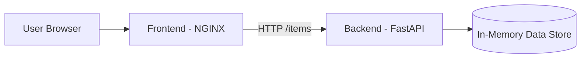

# Microservice Demo (FastAPI + HTML/JS + Docker + Kubernetes)

A lightweight fullstack microservice project built using **FastAPI**, **simple HTML/JavaScript frontend**, fully containerized with **Docker**, orchestrated using **Docker Compose** and **Kubernetes**.

This project is ideal for learning:
- Backend API development with FastAPI  
- Simple static frontend integration  
- Containerization with Docker  
- Multi‑service orchestration  
- Kubernetes deployments  
- CI/CD pipeline creation (optional future addition)  

---

# 🏗 Architecture Overview

### 🧠 **High‑Level Architecture**

```
Browser (Frontend)
     |
     |  HTTP (JavaScript fetch)
     v
Frontend (NGINX container)
     |
     |  HTTP
     v
Backend (FastAPI container)
     |
     |  In-memory list
     v
Fake Database
```

---

# 🎨 Mermaid Architecture Diagram



---

# 📂 Project Structure

```
microservice-demo/
│
├── backend/
│   ├── app/
│   │   ├── __init__.py
│   │   ├── main.py
│   │   ├── crud.py
│   │   ├── models.py
│   │   ├── database.py
│   │   └── schemas.py
│   ├── requirements.txt
│   └── Dockerfile
│
├── frontend/
│   ├── index.html
│   ├── script.js
│   ├── styles.css
│   └── Dockerfile
│
├── k8s/
│   ├── backend-deployment.yaml
│   ├── backend-service.yaml
│   ├── frontend-deployment.yaml
│   ├── frontend-service.yaml
│   └── ingress.yaml
│
└── docker-compose.yml
```

---

# 🛠 Tech Stack

**Backend:** FastAPI, Python  
**Frontend:** HTML, JavaScript, CSS  
**Containers:** Docker, Docker Compose  
**Orchestration:** Kubernetes (Deployments + Services + Ingress)  
**Web Server:** NGINX (for frontend)  

---

# ✨ Features

- Create items  
- List items  
- Simple and clean UI  
- Backend + Frontend containerized  
- Docker Compose support  
- Kubernetes deployment manifests  
- Easy to extend with CI/CD or real databases  

---

# 🔌 API Endpoints (FastAPI)

All endpoints return JSON.

### GET `/`
Health check / welcome message.

### GET `/items`
Returns all items.

### POST `/items`
Creates a new item.

Body:
```json
{
  "name": "Laptop",
  "description": "Gaming laptop"
}
```

### GET `/items/{id}`
Returns a single item.

---

# 🐳 Running with Docker Compose

Make sure Docker is installed.

### Build & start:
```
docker compose up --build
```

### Access application:
Frontend → http://localhost:8080  
Backend → http://localhost:8000/docs  

---

# ☸️ Kubernetes Deployment

### Build Docker images inside minikube:
```
minikube start --driver=docker
minikube -p minikube docker-env | Invoke-Expression

docker build -t backend:latest ./backend
docker build -t frontend:latest ./frontend
```

### Apply all k8s manifests:
```
kubectl apply -f k8s/
```

### Enable ingress:
```
minikube addons enable ingress
minikube tunnel
```

### Add to your Local-hosts file:
```
127.0.0.1 microservice.local
```

Visit:
```
http://microservice.local

```

---

# 📸 Screenshots

- **Frontend UI**


- **Swagger UI**


- **Docker containers running**


- **Kubernetes dashboard**


---

# 🤝 Contributing

Feel free to:
- Add a database (PostgreSQL, MongoDB)  
- Add GitHub Actions CI/CD  
- Write automated tests  
- Improve UI  

Pull requests welcome!

---

## 🚀 Author
Created by **Bithun Chatterjee**  
GitHub: https://github.com/goldenbutter  